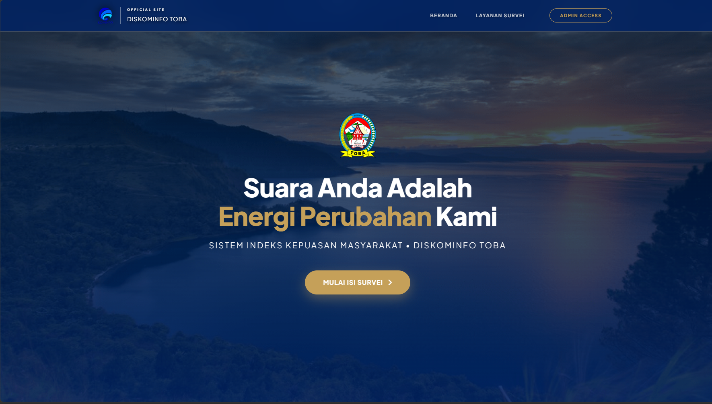
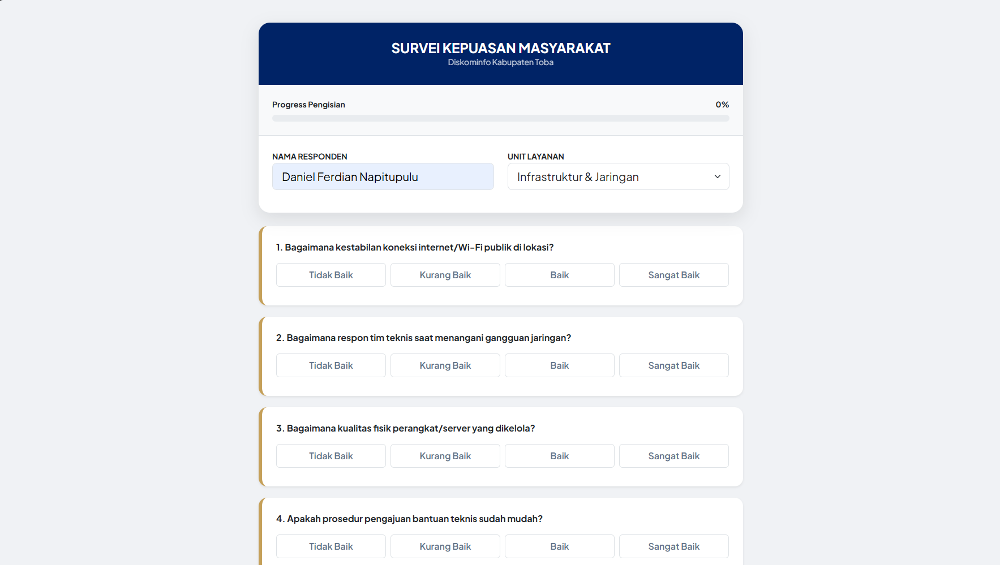
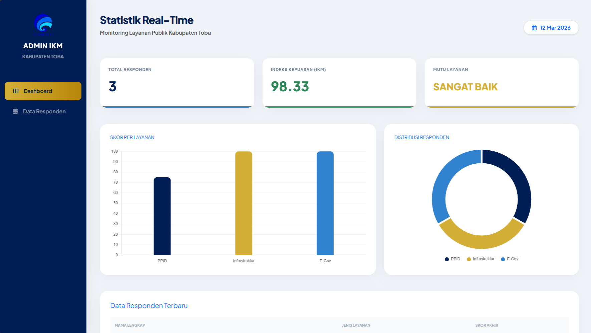

# Sistem Indeks Kepuasan Masyarakat (IKM) — Diskominfo Kabupaten Toba

<p align="center">
  
</p>

<p align="center">
  <a href="https://laravel.com"></a>
  <a href="https://www.php.net"></a>
  <a href="https://tailwindcss.com"></a>
  <a href="https://getbootstrap.com"></a>
  <a href="https://opensource.org/licenses/MIT"></a>
</p>

---

## 📌 Tentang Project

**Sistem Indeks Kepuasan Masyarakat (IKM)** Dinas Komunikasi dan Informatika (Diskominfo) Kabupaten Toba adalah platform berbasis web yang digunakan untuk mengukur, menganalisis, dan mengevaluasi tingkat kepuasan masyarakat terhadap layanan publik digital yang dikelola oleh Diskominfo Toba.

Sistem ini dirancang khusus untuk mempermudah masyarakat dalam memberikan penilaian secara transparan serta membantu pihak manajemen Diskominfo dalam memantau performa unit layanan secara *real-time* sesuai dengan indikator mutu pelayanan publik.

---

## 📸 Pratinjau Tampilan (Screenshots)

Berikut adalah beberapa tampilan utama dari Sistem IKM Diskominfo Toba:

| 🖥️ Halaman Utama (Landing Page) | 📝 Kuesioner Survei Dinamis |
| --- | --- |
|  |  |

| 📊 Dashboard Statistik Admin (Real-Time Analytics) |
| --- |
|  |

---

## ✨ Fitur Utama

Sistem ini dilengkapi dengan berbagai fitur fungsional untuk kebutuhan publik maupun administratif:

1. **Halaman Beranda Interaktif**: Halaman landing page modern dengan panduan langkah-langkah pengisian survei dan branding resmi Pemkab Toba.
2. **Kuesioner Survei Dinamis**:
   - Form survei memuat 5 butir pertanyaan evaluasi yang dimuat secara dinamis berdasarkan Unit Layanan yang dipilih.
   - **Progress Bar Pengisian**: Indikator persentase interaktif untuk memantau sejauh mana survei telah diisi.
   - Penilaian menggunakan skala Likert 1-4 (*Tidak Baik*, *Kurang Baik*, *Baik*, *Sangat Baik*).
3. **Dashboard Admin Executive**:
   - Ringkasan statistik responden (*Total Responden*, *Indeks Kepuasan (IKM)*, *Mutu Layanan*).
   - Grafik batang visual (*Bar Chart*) untuk rata-rata skor per unit layanan menggunakan **Chart.js**.
   - Grafik lingkaran (*Doughnut Chart*) untuk melihat distribusi sebaran jumlah responden per layanan.
   - Tabel riwayat respons responden terbaru.
4. **Manajemen Data & Ekspor**:
   - **Ekspor Laporan (Excel/CSV)**: Memungkinkan admin mengunduh seluruh data responden untuk kebutuhan pelaporan eksternal.
   - **Hapus Responden**: Fitur moderasi untuk menghapus data respons yang tidak valid.

---

## 🗺️ Struktur Layanan yang Dinilai

Kuesioner survei dibagi berdasarkan 3 Unit Layanan utama di Diskominfo Kabupaten Toba:
1. **PPID (Pejabat Pengelola Informasi dan Dokumentasi)**: Terkait kemudahan prosedur permohonan data, transparansi, dan kecepatan tanggapan informasi publik.
2. **Infrastruktur & Jaringan**: Terkait stabilitas koneksi Wi-Fi publik, respons penanganan kendala jaringan, dan kualitas infrastruktur IT.
3. **E-Government (Aplikasi)**: Terkait kemudahan navigasi portal daerah, kelengkapan fitur aplikasi, keamanan data, dan integrasi sistem.

---

## 🛠️ Teknologi & Library

Proyek ini dibangun menggunakan kombinasi teknologi modern:

- **Back-End**: [Laravel v12.x](https://laravel.com) (PHP >= 8.2)
- **Front-End Styling**: [Tailwind CSS v4.0](https://tailwindcss.com) (Vite Plugin) & [Bootstrap v5.3](https://getbootstrap.com) (CDN)
- **Database**: SQLite (Ringan, tanpa konfigurasi DBMS tambahan)
- **Charting Engine**: [Chart.js](https://www.chartjs.org/)
- **Utility / Fonts / Animations**:
  - [Font Awesome v6](https://fontawesome.com) (Icons)
  - [Animate.css](https://animate.style/) (Animasi transisi)
  - [Google Fonts - Plus Jakarta Sans](https://fonts.google.com/specimen/Plus+Jakarta+Sans) (Modern Typography)

---

## ⚙️ Panduan Instalasi (Local Development)

Ikuti langkah-langkah di bawah ini untuk menjalankan project di lingkungan lokal (*local machine*).

### 📋 Prasyarat (*Prerequisites*)
Pastikan Anda sudah menginstal alat-alat berikut:
- **PHP** >= 8.2
- **Composer** (Dependency manager PHP)
- **Node.js** & **NPM**
- **Git**

---

### 🚀 Cara Cepat (Shortcut Setup)
Jika Anda menggunakan Composer di komputer, Anda bisa menjalankan satu baris perintah otomatis ini untuk mengonfigurasi seluruh aplikasi:

```bash
composer run setup
```
*Perintah di atas akan otomatis menjalankan: `composer install` ➡️ menyalin `.env` ➡️ generate key ➡️ membuat file database SQLite dan menjalankan migrasi database ➡️ menginstal package NPM ➡️ melakukan compile assets.*

---

### 🔧 Langkah Manual (Jika Shortcut Tidak Digunakan)

1. **Clone Repository**:
   ```bash
   git clone https://github.com/danielferdiann/ikm-kominfo-toba.git
   cd ikm-kominfo-toba
   ```

2. **Instal dependensi Composer**:
   ```bash
   composer install
   ```

3. **Salin File Environment**:
   ```bash
   copy .env.example .env
   ```

4. **Generate Application Key**:
   ```bash
   php artisan key:generate
   ```

5. **Konfigurasi & Migrasi Database**:
   - Pastikan variabel database di file `.env` mengarah ke SQLite:
     ```env
     DB_CONNECTION=sqlite
     ```
   - Buat file database kosong secara manual di folder database:
     - **Windows (Command Prompt / Powershell)**:
       ```powershell
       New-Item -ItemType File -Path "database/database.sqlite" -Force
       ```
     - **Linux / macOS**:
       ```bash
       touch database/database.sqlite
       ```
   - Jalankan migrasi database dan seeder default:
     ```bash
     php artisan migrate --seed
     ```

6. **Instal Dependensi Node (NPM) & Compile Assets**:
   ```bash
   npm install
   npm run build
   ```

---

## 💻 Cara Menjalankan Project

Untuk menjalankan server pengembangan lokal secara efisien (menjalankan web server Laravel, compiler Vite, antrean, dan logging sekaligus), gunakan skrip *concurrent* berikut:

```bash
composer run dev
```

Atau jalankan secara terpisah menggunakan perintah bawaan:
- Menjalankan Server Laravel: `php artisan serve` (Buka di browser: `http://127.0.0.1:8000`)
- Menjalankan HMR Vite: `npm run dev`

---

## 🔒 Akses Kredensial Administrator

Untuk menguji fitur administrasi seperti melihat statistik dan mengunduh laporan Excel, silakan masuk melalui halaman `/login` dengan kredensial bawaan berikut (yang didapatkan setelah melakukan seeding database):

* **Halaman Login**: `http://127.0.0.1:8000/login`
* **Username / Email**: `test@example.com`
* **Password**: `password`

> 💡 *Catatan: Anda juga bisa menambahkan user admin baru melalui Laravel Tinker menggunakan perintah `User::factory()->create()`.*

---

## 📁 Struktur Direktori Penting

* `app/Http/Controllers/` - Logika penanganan rute, penghitungan rumus skor IKM, dan ekspor CSV.
* `app/Models/` - Model database (`Responden.php`, `User.php`).
* `database/migrations/` - Struktur skema tabel responden dan pengguna.
* `resources/views/` - File Blade untuk tampilan halaman utama, survei, login, dashboard, dan terimakasih.
* `routes/web.php` - Rute aplikasi web.
* `public/img/` - Aset gambar statis, logo instansi, dan screenshots dokumentasi.

---

### 📝 Kontributor & Lisensi
- Dikembangkan oleh **Daniel Ferdian Napitupulu** (Prototype Magang Diskominfo Toba).
- Proyek ini dirilis di bawah [Lisensi MIT](https://opensource.org/licenses/MIT).
